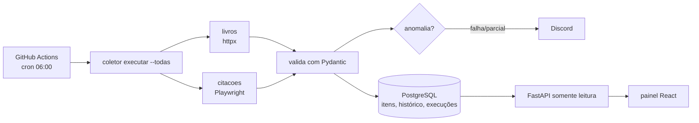
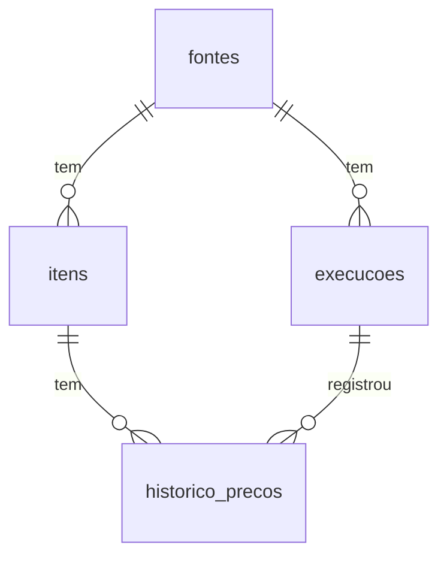

# coletor-diario

[](https://github.com/MateusGitBoss/coletor-diario/actions/workflows/ci.yml)
[](https://github.com/MateusGitBoss/coletor-diario/actions/workflows/coleta-diaria.yml)

Robô que coleta dados de sites todos os dias, guarda tudo no PostgreSQL, registra cada execução e avisa no Discord quando algo dá errado, inclusive quando "dá certo" mas traz bem menos dados que o normal.

**Explicação para quem não é da área:** todo dia às 6h um robô abre dois sites sozinho, copia as informações (livros com preço e estoque, e citações), guarda numa base de dados organizada e manda mensagem no Discord se o site saiu do ar, mudou de formato ou trouxe menos coisa que de costume. Quem precisa investigar tem o histórico de cada execução, o motivo da falha e um print da tela no momento do erro.

## Fontes

| Fonte | Site | Técnica | Por quê |
|---|---|---|---|
| `livros` | [books.toscrape.com](https://books.toscrape.com) | HTTP (`httpx`) + parser HTML | Página estática: navegador seria desperdício |
| `citacoes` | [quotes.toscrape.com/js](https://quotes.toscrape.com/js/) | Navegador (Playwright + Chromium) | O conteúdo só aparece depois que o JavaScript roda |

Os dois sites existem para treino de raspagem, então não há problema legal ou de termos de uso.

## Arquitetura



Cada execução passa por: **coleta → validação → gravação idempotente → avaliação de volume → alerta**.

| Status | Quando |
|---|---|
| `sucesso` | Coletou normalmente |
| `parcial` | Menos de 50% da média das últimas 7 execuções boas, ou mais de 10% de itens inválidos |
| `falha` | Exceção na coleta (site fora, timeout, página mudou) ou zero itens válidos |

## Banco de dados



As migrações ficam em [`src/coletor/migrations`](src/coletor/migrations) e são aplicadas em ordem, uma vez cada. Consultas prontas para investigar problemas estão em [`docs/consultas.sql`](docs/consultas.sql).

## Como rodar

Pré-requisitos: Python 3.12, [uv](https://docs.astral.sh/uv/) e Docker.

```bash
git clone https://github.com/MateusGitBoss/coletor-diario && cd coletor-diario
cp .env.example .env
docker compose up -d banco            # PostgreSQL local
uv sync                               # dependências
uv run playwright install chromium    # navegador para a fonte "citacoes"

uv run coletor migrar
uv run coletor executar --todas       # ou --fonte livros
uv run coletor execucoes --ultimas 10
uv run coletor fontes

uv run uvicorn coletor.api:app --reload   # API em http://localhost:8000/docs
```

Tudo em Docker: `docker compose run --rm coletor`.

### Testes e qualidade

```bash
uv run pytest        # testes (os de banco usam DATABASE_URL_TESTE; sem ele são pulados)
uv run ruff check .  # lint
uv run mypy          # tipos
```

Os testes não acessam a internet: usam HTML salvo em `tests/fixtures` e um servidor local que imita uma página montada por JavaScript para testar o Playwright de verdade.

## API

| Rota | Retorna |
|---|---|
| `GET /saude` | Se a API alcança o banco |
| `GET /fontes` | Cada fonte com o status da última execução |
| `GET /execucoes?fonte=&limite=` | Histórico de execuções |
| `GET /execucoes/{id}` | Detalhe de uma execução, com erro e exemplos de inválidos |
| `GET /itens?fonte=&limite=` | Itens coletados |

## Variáveis de ambiente

| Variável | Para quê |
|---|---|
| `DATABASE_URL` | Banco onde o robô grava |
| `DATABASE_URL_TESTE` | Banco descartável dos testes |
| `DISCORD_WEBHOOK_URL` | Canal que recebe os alertas (vazio = só log) |
| `LIMIAR_ANOMALIA` / `JANELA_ANOMALIA` | Regra de queda de volume (padrão 0.5 e 7) |
| `CORS_ORIGENS` | Origens liberadas para o painel |

## Agendamento em produção

O workflow [`coleta-diaria.yml`](.github/workflows/coleta-diaria.yml) roda todo dia às 06:00 (horário de Brasília) e pode ser disparado à mão em *Actions → Coleta diária → Run workflow*. Para gravar num banco permanente, cadastre em *Settings → Secrets and variables → Actions*:

- `DATABASE_URL`: string de conexão do Supabase (use a do *Session pooler*, porque o GitHub Actions não tem IPv6).
- `DISCORD_WEBHOOK_URL`: webhook do canal de alertas.

Sem esses segredos o workflow usa um PostgreSQL temporário: a coleta roda e gera relatório, mas o histórico não fica guardado entre os dias.

Cada execução deixa um resumo na página do workflow e, se falhar, um artefato com print e HTML da tela.

## Decisões técnicas

- **HTTP onde dá, navegador só onde precisa.** Playwright é bem mais lento e pesado; usar nos dois sites seria custo sem ganho.
- **SQL escrito à mão (psycopg 3) em vez de ORM.** O projeto é pequeno e a investigação de falhas é feita em SQL, então o SQL fica visível.
- **Preço em centavos (inteiro).** `float` não representa 0,1 exatamente; dinheiro em float acumula erro.
- **Upsert idempotente.** Rodar a coleta duas vezes no mesmo dia não duplica itens.
- **Retry só em erro transitório.** Rede e 5xx podem passar sozinhos; 404 ou HTML diferente não melhoram repetindo.
- **GitHub Actions como agendador.** Grátis e com logs. O limite é que o cron pode atrasar e não é para tarefas de minuto em minuto; para isso usaria cron numa VPS ou um worker no Railway.

## Limitações conhecidas

- Sem fila: se o Discord estiver fora, o alerta fica só no log.
- A regra de anomalia olha apenas volume; não detecta, por exemplo, todos os preços zerados.
- Execuções interrompidas no meio ficam como `em_andamento` (a consulta 3 de `docs/consultas.sql` encontra essas).

## Como este projeto foi construído

Construído com o Claude Code como ferramenta de desenvolvimento, com cada mudança entrando por pull request revisado. O roteiro de estudo em [`docs/ENTREVISTA.md`](docs/ENTREVISTA.md) explica cada decisão.

## Licença

MIT
